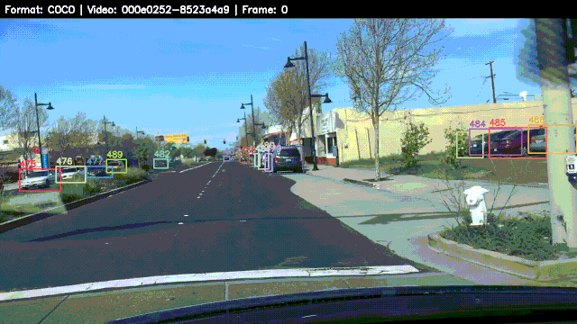

# 🚗 BDD-Mini: Lightweight Dataset Builder

**BDD-Mini** is a specialized tool designed to create a "Mini-Dataset" for Multi-Object Tracking (MOT) training.

It supports building **Hybrid Datasets** by mixing ground-level autonomous driving footage (**BDD100K**) with aerial drone footage (**VisDrone**).

Instead of downloading the massive 32GB+ BDD dataset, this tool **streams** BDD data from official mirrors, extracting only the specific video sequences and frames you need. It automatically formats everything (Ground + Drone) into unified **COCO-Video** (for Transformers like MOTIP) and **MOTChallenge** (for TrackEval) formats.

<p align="center">
  
</p>

## 🚀 Features

* **Smart Streaming:** Connects to remote zip archives via HTTP Range Requests to download *only* the frames you need.
* **Resume Capability:** Images are cached locally in `data/image_cache`. If you interrupt the script (`Ctrl-C`), simply run it again to resume exactly where you left off.
* **Multi-Format Export:** Generates both **COCO-Video** JSONs (Train/Val/Test) and **MOTChallenge** (`gt.txt`) formats simultaneously.
* **Configurable Splits:** Define your own Train/Val/Test ratios in `config.toml` (e.g., 70/15/15).
* **Visualization Tools:** Includes a renderer to generate MP4 movies with bounding boxes directly from your generated labels (COCO or MOT) using FFmpeg.
* **Defensive Parsing:** Validates source data integrity to prevent crashes on malformed JSONs.


## 📂 Project Structure
```bash
bdd-mini/
├── config.toml          
├── setup.sh             # 🛠️ Installation script (creates venv)
├── builder.py           # 🏗️ Main script (streams, splits & builds dataset)
├── render.py            # 🎬 Visualization tool (renders MP4s from labels)
├── cleanup.sh           # 🧹 Safer cleanup (protects image cache)
├── venv/                # 🐍 Virtual environment
├── data/                # 📦 Local cache (labels & image_cache)
└── output/              # 📤 Final Dataset Location
    └── mini_bdd/
        ├── annotations/ # 📄 COCO Format (train.json, val.json)
        ├── mot_format/  # 📄 MOT Format (gt/gt.txt, seqinfo.ini)
        └── images/      # 🖼️ Images sorted by split (train/val/test)
```

## 🛠️ Installation

1.  **Run the Setup Script:**
    This creates the Python virtual environment and installs dependencies (`remotezip`, `tqdm`, `opencv-python`).

    chmod +x setup.sh
    ./setup.sh

2.  **Install FFmpeg (Optional but Recommended):**
    Required for `render.py` to generate visualization videos.
    * **Mac:** `brew install ffmpeg`
    * **Linux:** `sudo apt install ffmpeg`


## 🏃 Usage

### 1. Build the Dataset
Activate the environment and run the builder. It will download labels, select random videos, and stream frames.


source venv/bin/activate
python3 builder.py

* **Interrupting:** You can hit `Ctrl-C` at any time. Progress is saved in `data/image_cache`. Run the command again to resume instantly.

### 2. Visualize the Data
Verify your dataset by rendering a video with bounding boxes drawn from the generated labels.

#### Render a random video from the Training set (COCO format)
```bash
python3 render.py
```
#### Render from the Validation set
```bash
python3 render.py --split val
```

#### Verify MOTChallenge export format specifically
```bash
python3 render.py --format mot
```

**Output:** Videos are saved to `output/rendered/`.

### 3. Clean Up
To remove generated outputs (e.g., to re-roll random videos) while **keeping the downloaded image cache**:

```bash
./cleanup.sh
```
*(The script will ask for confirmation before deleting the cache).*


## ⚙️ Configuration (`config.toml`)

Control every aspect of the dataset generation here.

```bash
[dataset]
num_videos = 20           # Total videos to select
seed = 42                 # Random seed for reproducibility
output_dir = "output/mini_bdd"
frame_step = 5            # Sample 1 frame every N frames (5 = ~6FPS)

# Export Formats
# "coco" -> annotations/train.json (for MOTIP/MOTR)
# "mot"  -> mot_format/train/Video/gt/gt.txt (for TrackEval)
export_formats = ["coco", "mot"]

# Data Splits (Must sum to 1.0)
train_ratio = 0.70
val_ratio   = 0.15
test_ratio  = 0.15
```

## ❓ Troubleshooting

* **"Streaming Error / Connection Reset"**
The script relies on the ETH Zurich mirror. If unstable, try again later or check your internet connection. The Resume feature ensures you don't lose progress.

* **"FFmpeg not found"**
If `render.py` fails, ensure ffmpeg is installed and in your system PATH.

VisDrone videos often have odd resolutions (e.g., 1365px width). The included `render.py` attempts to automatically fixes this by resizing frames to even dimensions before rendering.
* **"Dataset is empty"**
Check `config.toml`. If `num_videos` is too high (e.g., >200), the script might struggle to find enough matching sequences in the specific label zip file provided.

* **"Streaming Error / Connection Reset"**
The script relies on the ETH Zurich mirror for BDD data. If unstable, try again later or check your internet connection. The Resume feature ensures you don't lose progress.

---

## 📝 License
* **BDD100K:** Subject to the [BDD100K License](https://doc.bdd100k.com/license.html).
* **VisDrone:** Subject to the [VisDrone Dataset License](http://aiskyeye.com/).